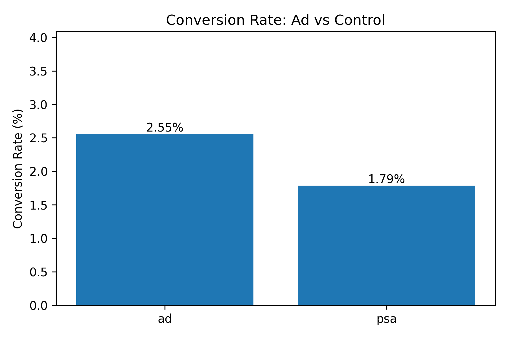
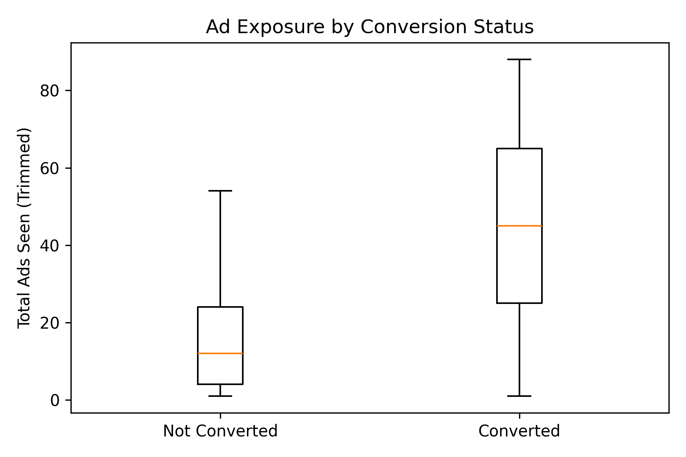
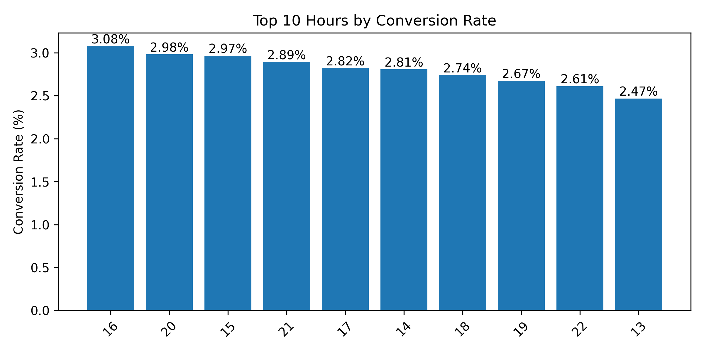

# A/B Testing Analysis – Marketing Campaign Evaluation

## Executive Summary
- The advertisement increased conversion from 1.79% (control) to 2.55% (ad group).
- This uplift was statistically significant (p < 0.001).
- Higher ad exposure was associated with increased likelihood of conversion.
- Performance varied by time of day.
- Findings support continued ad investment with optimisation of timing and frequency.

## Overview
A marketing team requested an independent evaluation of an A/B test comparing paid advertisements against a control (PSA/no ad).
The objective was to validate performance uplift, quantify impact, and determine whether observed differences were statistically reliable before scaling budget.

## Business Questions
1. Did paid advertising increase conversion?
2. Was the uplift statistically significant?
3. Do timing and frequency influence outcomes?
4. What are the optimisation opportunities?

## Methodology
### Data Preparation
- Verified unique users
- Removed irrelevant fields
- Checked for missing values and anomalies
- Prepared data for group comparison

### Analysis
- Compared conversion rates between test and control
- Examined performance by hour
- Analysed distribution of ad exposure
- Trimmed extreme outliers for clearer behavioural comparison

### Statistical Validation
- Chi-squared test confirmed conversion uplift significance (p < 0.001)
- Mann-Whitney U test confirmed higher ad exposure among converters (p < 0.001)

## Key Findings
- The advertisement group achieved a materially higher conversion rate than the control.
- The uplift was statistically reliable and unlikely due to chance.
- Users who converted saw significantly more ads (median exposure notably higher).
- Conversion probability varied by hour of exposure, suggesting optimisation opportunity.

### Conversion Rate: Ad vs Control

### Ad Exposure by Conversion Status

### Top Performing Hours

## Outcome & Recommendations

The analysis confirmed that paid advertising produced a statistically significant uplift in conversion.

Recommended actions:
- Optimise delivery toward higher-performing hours
- Evaluate optimal exposure thresholds
- Continue monitoring uplift before scaling spend

This work provided a validated evidence base for budget allocation decisions.

## Tools Used
Python · Pandas · SciPy · Matplotlib · Seaborn
A/B testing methodology · Statistical inference · Behavioural analysis
